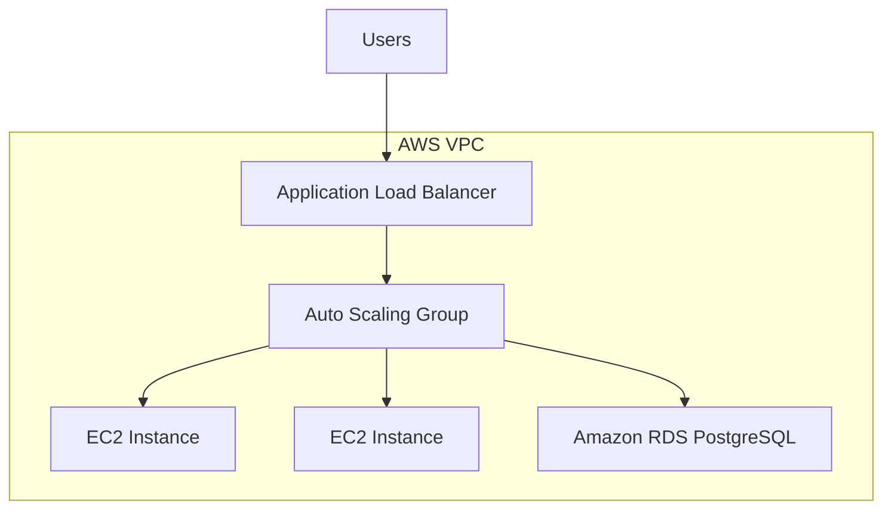

# AWS Scalable Architecture (ALB + Auto Scaling + RDS)

## AWS Architecture Diagram

## Core Components

### Clients
- Web or mobile clients
- Communicate over HTTPS
- Traffic terminates at the Application Load Balancer

### Application Load Balancer (ALB)
- Internet-facing
- Deployed in public subnets
- Routes traffic to EC2 instances
- Performs health checks
- Enables horizontal scaling

### EC2 Auto Scaling Group
- Application servers run on EC2 instances
- Deployed in private subnets
- Automatically scales based on demand
- Replaces unhealthy instances automatically
- Instances are treated as disposable

### Networking (VPC)
- Single VPC
- Public subnets for ALB
- Private subnets for EC2 instances
- Security groups enforce least-privilege access

### Data Layer

**PostgreSQL (Amazon RDS)**
- Primary persistent data store
- Multi-AZ deployment for high availability
- Read replicas supported for read-heavy workloads
- Database is not publicly accessible

## Infrastructure as Code

All infrastructure is defined using **Terraform**.

Key resources include:
- VPC and subnet definitions
- Application Load Balancer
- Auto Scaling Groups
- Security Groups
- RDS instances and replicas

This enables:
- Reproducible environments
- Clear change history
- Safe iteration on architecture decisions

## Scaling Strategy

### Application Layer
- Horizontal scaling via Auto Scaling Groups
- Load distributed by ALB
- Stateless application design assumed

### Database Layer
- Vertical scaling for write-heavy workloads
- Read replicas for scaling reads
- Indexing for performance

## Failure Scenarios & Mitigations

| Failure Scenario   | Impact                     | Mitigation                                      |
| :------------------- | :---------------------------- | :------------------------------------------------- |
| EC2 instance crash | Minimal disruption         | ASG replaces instance automatically              |
| Traffic spike      | Increased load             | ASG scales out instances                         |
| ALB target failure | Reduced capacity           | ALB routes traffic to healthy targets            |
| DB instance failure| Temporary DB interruption  | RDS Multi-AZ automatic failover                  |
| AZ outage          | Partial capacity loss      | Multi-AZ deployment                              |

## Security Considerations

- EC2 instances run in private subnets
- Database is not publicly accessible
- Security groups restrict inbound and outbound traffic
- IAM roles used for instance permissions
- No credentials committed to source control

## Observability

- Load balancer health checks
- Auto Scaling Group metrics
- CloudWatch metrics and logs
- Visibility into instance health and scaling events

## Deployment Status

- Infrastructure: Defined via Terraform
- Application code: Minimal / placeholder
- Focus: Architecture and infrastructure design

This project is intentionally infrastructure-centric.

## Tradeoffs

- EC2 + Auto Scaling was chosen over managed container services to emphasize core AWS scaling primitives
- This architecture provides more operational visibility at the cost of increased management overhead
- ECS or serverless architectures could reduce operational complexity but abstract key scaling behaviors

## Project Scope

This project prioritizes:
- Clear system design
- AWS fundamentals
- Scalability and fault tolerance

It does **not** attempt to build a full application or UI.

## AWS Console Screenshots

The `images/` directory contains screenshots from the AWS Console showing the infrastructure after successful deployment, including:

- VPCs and subnet configuration
- Application Load Balancer and target groups
- EC2 instances managed by Auto Scaling Groups
- Scaling limits and health checks
- RDS primary instance and read replicas

These screenshots are included to provide visual confirmation of the deployed architecture.

## Summary

This repository demonstrates a practical, production-inspired AWS architecture using well-established scaling and reliability patterns. It reflects real-world infrastructure decisions and tradeoffs commonly encountered in backend and platform engineering roles.