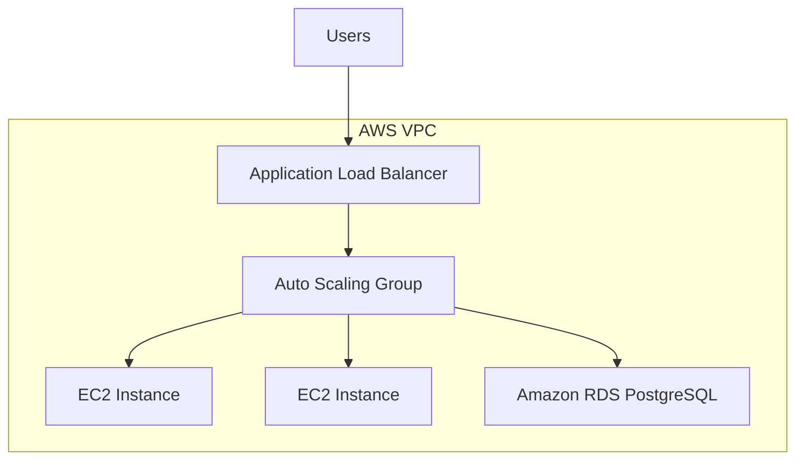
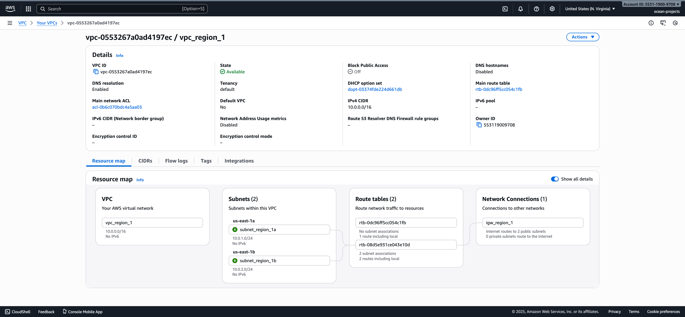
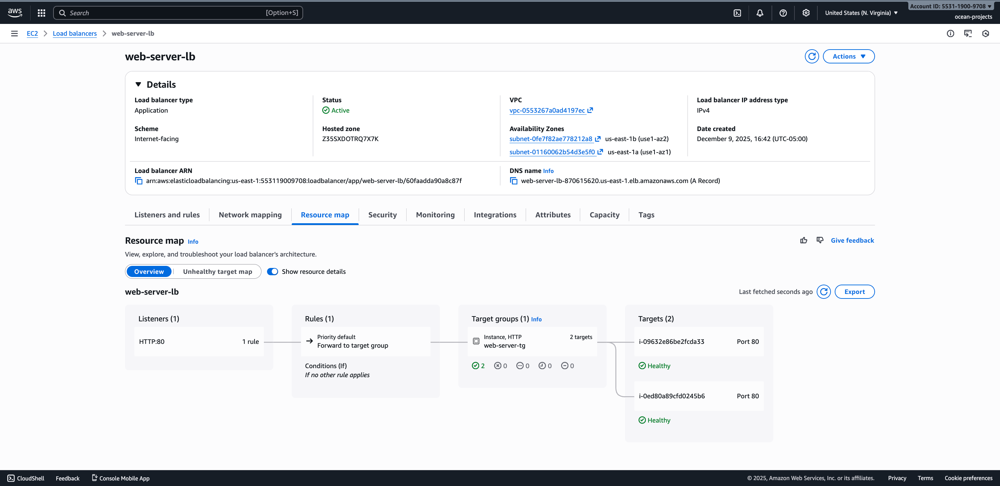
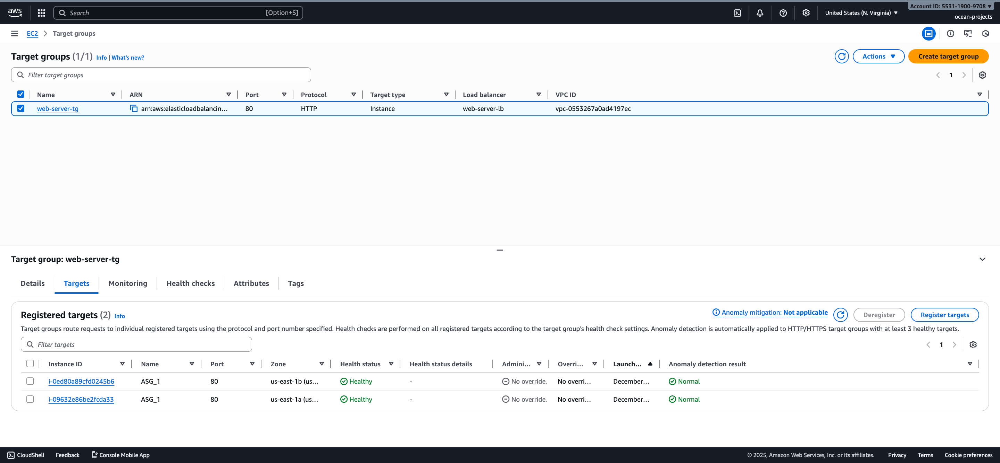
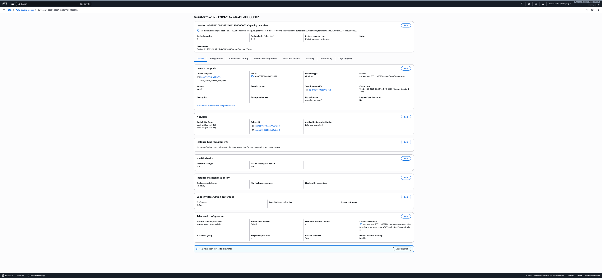
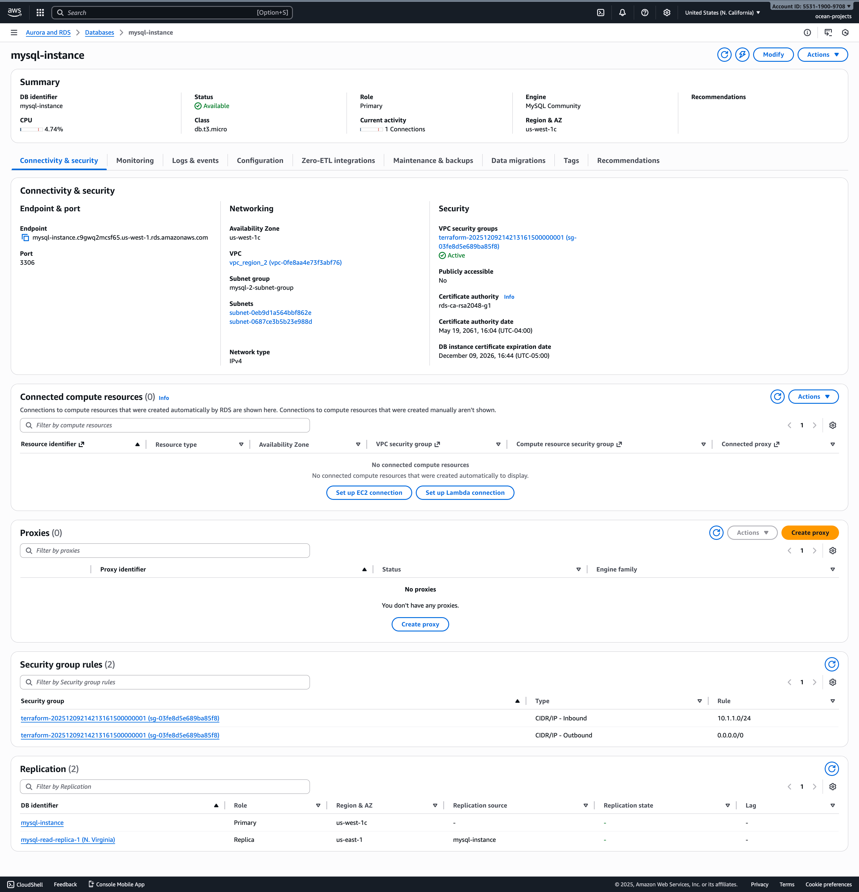

# AWS Scalable Architecture 


**ALB + Auto Scaling Group + Private Subnets + RDS (Multi-AZ)**

This repository contains a **production-style AWS reference architecture** provisioned with **Terraform**, designed for **scalability**, **high availability**, and **security-first networking**.

The goal is to demonstrate how to design and provision the infrastructure that supports a real backend system — not to showcase application features.


## AWS Architecture Diagram




## Core Components

### Clients
- Web or mobile clients
- Communicate over HTTPS
- Traffic terminates at the Application Load Balancer

### Application Load Balancer (ALB)
- Internet-facing
- Deployed in public subnets
- Routes traffic to EC2 instances
- Performs health checks
- Enables horizontal scaling

### EC2 Auto Scaling Group
- Application servers run on EC2 instances
- Deployed in private subnets
- Automatically scales based on demand
- Replaces unhealthy instances automatically
- Instances are treated as disposable

### Networking (VPC)
- Single VPC
- Public subnets for ALB
- Private subnets for EC2 instances
- Security groups enforce least-privilege access

### Data Layer

**PostgreSQL (Amazon RDS)**
- Primary persistent data store
- Multi-AZ deployment for high availability
- Read replicas supported for read-heavy workloads
- Database is not publicly accessible


## AWS Console Screenshots

### VPC Architecture (Region 1)
Demonstrates public and private subnet segmentation within the VPC.




### Application Load Balancer (Region 1)
Public-facing ALB distributing traffic across targets.




### Target Group Health Checks
ALB routing traffic only to healthy EC2 instances.




### Auto Scaling Group Configuration
ASG capacity configuration and scaling boundaries.




### RDS with Replication
Database replication and high availability configuration.



* Additional screenshots in images folder


## Infrastructure as Code

All infrastructure is defined using **Terraform**.

Key resources include:
- VPC and subnet definitions
- Application Load Balancer
- Auto Scaling Groups
- Security Groups
- RDS instances and replicas

This enables:
- Reproducible environments
- Clear change history
- Safe iteration on architecture decisions


## Terraform Layout

```text
└── aws-scalable-architecture/
    ├── images
    ├── main.tf
    ├── variables.tf
    ├── outputs.tf
    └── (optional) modules/
```


## Deployment and Testing

### Requirements

Before deploying, ensure you have:

- AWS account with programmatic access
- AWS CLI installed and configured (`aws configure`)
- Terraform >= 1.5 installed
- IAM user/role with permissions for:
  - VPC
  - EC2
  - Auto Scaling
  - ALB
  - RDS
  - IAM (if applicable)

Verify installations:

```bash
aws --version
terraform -version
```

### Deploy

Clone the repository and navigate to the Terraform directory:

```bash
git clone https://github.com/oceean-projects/aws-scalable-architecture.git
cd aws-scalable-architecture
```

Initialize terraform

```bash
terraform init
```

Review the execution plan:

```bash
terraform plan
```

Apply the infrastructure:

```bash
terraform apply
```

Confirm with yes when prompted.

After successful deployment, Terraform will output relevant resource information (e.g., ALB DNS name).

### Test

Retrieve the ALB DNS name from Terraform output:

```bash
terraform output
```

Test the application endpoint:

```bash
curl http://<alb-dns-name>
```

You should receive a valid HTTP response from one of the EC2 instances behind the load balancer.

To verify scaling:
	1.	Trigger load (optional: use a load testing tool).
	2.	Monitor the Auto Scaling Group in the AWS Console.
	3.	Observe new EC2 instances launching when scaling thresholds are met.


## Destroy

To tear down all provisioned infrastructure:

```bash
terraform destroy
```

Confirm with yes when prompted.

This will remove all AWS resources created by this Terraform configuration.

Always destroy unused infrastructure to avoid unnecessary AWS charges.


## Scaling Strategy

### Application Layer
- Horizontal scaling via Auto Scaling Groups
- Load distributed by ALB
- Stateless application design assumed

### Database Layer
- Vertical scaling for write-heavy workloads
- Read replicas for scaling reads
- Indexing for performance


## Failure Scenarios & Mitigations

| Failure Scenario   | Impact                     | Mitigation                                      |
| :------------------- | :---------------------------- | :------------------------------------------------- |
| EC2 instance crash | Minimal disruption         | ASG replaces instance automatically              |
| Traffic spike      | Increased load             | ASG scales out instances                         |
| ALB target failure | Reduced capacity           | ALB routes traffic to healthy targets            |
| DB instance failure| Temporary DB interruption  | RDS Multi-AZ automatic failover                  |
| AZ outage          | Partial capacity loss      | Multi-AZ deployment                              |


## Security Considerations

- EC2 instances run in private subnets
- Database is not publicly accessible
- Security groups restrict inbound and outbound traffic
- IAM roles used for instance permissions
- No credentials committed to source control


## Observability

- Load balancer health checks
- Auto Scaling Group metrics
- CloudWatch metrics and logs
- Visibility into instance health and scaling events


## Deployment Status

- Infrastructure: Defined via Terraform
- Application code: Minimal / placeholder
- Focus: Architecture and infrastructure design

This project is intentionally infrastructure-centric.


## Tradeoffs

- EC2 + Auto Scaling was chosen over managed container services to emphasize core AWS scaling primitives
- This architecture provides more operational visibility at the cost of increased management overhead
- ECS or serverless architectures could reduce operational complexity but abstract key scaling behaviors


## Project Scope

This project prioritizes:
- Clear system design
- AWS fundamentals
- Scalability and fault tolerance

It does **not** attempt to build a full application or UI.


## Summary

This repository demonstrates a practical, production-inspired AWS architecture using well-established scaling and reliability patterns. It reflects real-world infrastructure decisions and tradeoffs commonly encountered in backend and platform engineering roles.
